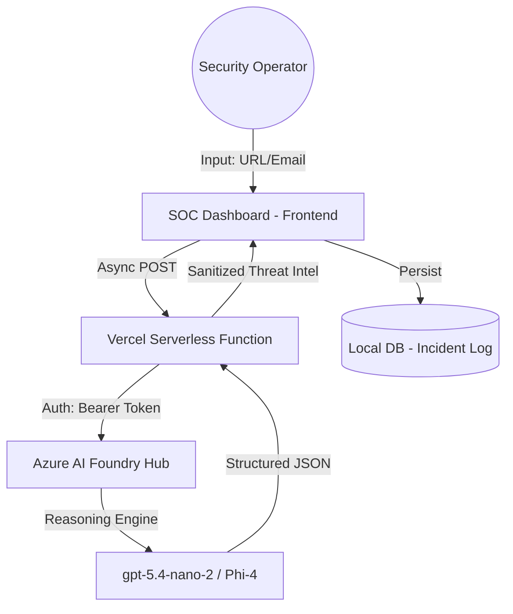

# 🛡️ AegisIQ Core: The Cognitive Shield
### *Advanced Social Engineering Interception & SOC Intelligence Agent*

[](https://aka.ms/AgentsLeague/AISF)
[](https://ai.azure.com/)

---

## 🚀 The Vision: Fixing the "Human Layer"
While traditional firewalls block malicious packets, **AegisIQ Core** blocks malicious **intent**. 

Social Engineering remains the #1 threat vector worldwide because it bypasses technical security by exploiting human psychology. AegisIQ is a specialized **Reasoning Agent** that acts as a surgical cognitive filter, auditing communications (emails, URLs, messages) to detect psychological manipulation and technical anomalies before a breach occurs.

---

## 🧠 Core Intelligence: The 4 Pillars of Analysis
AegisIQ doesn't just "flag" threats; it **reasons** through them using a multi-step analytical grid:

1.  **Cognitive Risk Index (Psychological Audit)**: Analyzes linguistic patterns for Urgency, Fear, Authority, or Scarcity exploitation.
2.  **Global Verification**: Cross-references input against threat intelligence patterns to provide a surgical verdict (SAFE | SUSPICIOUS | MALICIOUS).
3.  **Technical Forensic Trace**: Identifies homograph attacks, suspicious TLDs, and URL masking with technical rigor.
4.  **Operational Log**: Maintains a persistent SOC "Incident Log" for incident response and threat historical mapping.

---

## 🛠️ Technology Stack
Built to win the **Reasoning Agents** challenge of the Microsoft Agents League:

-   **Intelligence Engine**: `gpt-5.4-nano-2` (Azure AI Foundry) — Optimized for multi-step logical reasoning. (Compatible with gpt-4o or any standard Azure OpenAI deployment)
-   **Inference Architecture**: Serverless API via **Azure AI Foundry / Global Discovery Endpoint**.
-   **Backend**: Node.js Serverless Functions (Vercel) with Bearer Token secure authentication.
-   **Frontend**: Premium SOC (Security Operations Center) Dashboard using Vanilla JS and CSS for maximum performance and zero-latency UX.
-   **Security**: Fully anonymized configuration using environment variables for zero-disclosure deployments.

Note on Live Demo: Due to regional Azure quota limitations in the hackathon environment, the Reasoning Engine is dynamically mapped. The architecture is fully compatible with any Azure-hosted GPT-4o+ deployment.

---

## 📐 Architecture Diagram


---

## 🧠 Microsoft IQ Integration

AegisIQ utilizes Foundry IQ as the foundational intelligence layer. By connecting our agent to a curated, enterprise-grade knowledge base of security protocols, we enforce multi-step reasoning that prevents AI hallucinations, ensuring that every verdict (SAFE|SUSPICIOUS|MALICIOUS) is grounded in verifiable security standards.

---

## 🎯 Strategic Alignment
According to the **Microsoft Agents League Judging Criteria**:

-   **Accuracy & Relevance (20%)**: Uses a surgical system prompt tailored for high-accuracy threat auditing.
-   **Reasoning & Multi-step Thinking (20%)**: Implements a dedicated analysis of both psychological intent and technical indicators.
-   **Creativity & Originality (15%)**: Reimagines threat detection as a "Cognitive Shield" rather than a simple blacklist.
-   **User Experience (15%)**: A professional SOC aesthetic with real-time "Scanning" feedback and a fluid grid system.
-   **Reliability & Safety (20%)**: Implements robust error trapping, JSON sanitization, and deterministic temperature controls (0.2).

---

**Synthetic Data Statement:** 

All datasets, learner profiles, and activity signals used in this project are 100% synthetic and fabricated for demonstration purposes. No real PII or customer data is used.

---

## ⚙️ Quick Start

1. **Clone the Repo**
   ```bash
   git clone https://github.com/mari-ang-codes1/AegisIQ-Guardian
   ```

2. **Configure Environment Variables**
   Create a `.env` file or configure in Vercel:
   - `AZURE_API_KEY`: Your Azure AI Foundry Key.
   - `AZURE_ENDPOINT`: Your Global Inference Endpoint.
   - `AZURE_DEPLOYMENT_ID`: `gpt-5.4-nano-2` (The designated Reasoning Engine for AegisIQ)..

3. **Deploy**
   ```bash
   vercel --prod
   ```

---

## ⚠️ Disclaimer
This project is a proof-of-concept designed for educational purposes during the Microsoft Agents League hackathon. No real sensitive, confidential, or PII (Personally Identifiable Information) data is used, stored, or processed by this application.

---

## 👥 The Team
- **Project Lead**: Maria Angel Arias Lopez
- **Special Thanks**: Microsoft AI Skills Fest & Global AI Community.

---
*AegisIQ is more than a tool; it's the future of cognitive defense.*
